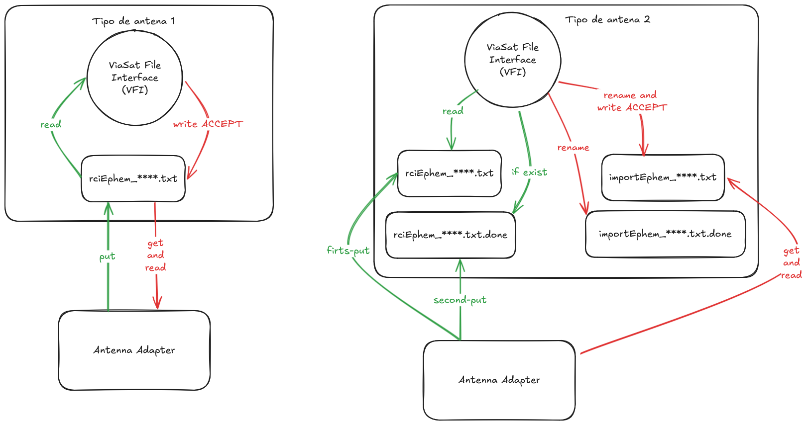

# Viasat File Interface

Interfaz de la antena donde se realiza la carga de **Planificacion** y **TLE**. Esta interfaz es un inbox (ViaSat File Interface - VFI) en donde se depositan los archivos del tipo `rciEphem_lo-que-sea`.

* RCIDIR path `/home/scc/etc/remote/`
* Ephemeris file `$RCIDIR/rciEphem.xxx`
* Done file `$RCIDIR/rciEphem.xxx.done`
* Import done file `$RCIDIR/importEphem.xxx.done`
* Import status file `$RCIDIR/importEphem.xxx`

### Ejemplo

El archivo debe empezar con una `n` para que sepa que es formato **3 Lines**
```
n
SAOCOM-1B
1 99982U 99999Z   20243.98136574 0.00000000  00000-0 000000+0 0    08
2 99982  97.8909  67.8106 0000213 105.4511  73.0588 14.87233698    04
```

Se envian los archivos (por SCP o SFTP) al servidor de la antena
```
/home/scc/etc/remote/rciEphem_SAOCOM-1B.txt
/home/scc/etc/remote/rciEphem_SAOCOM-1B.txt.done
```

### TLE load




