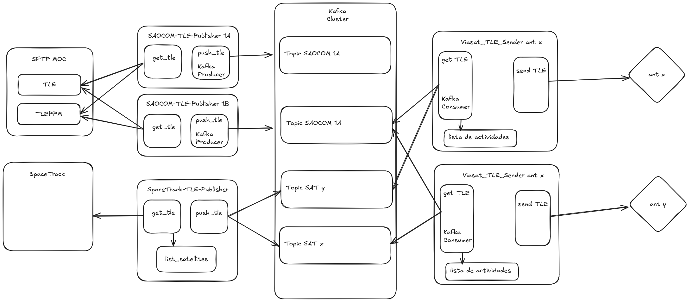

# Viasat TLE Sender

Servicio que se encarga de obtener el TLE desde el brocker, formatearlo y mandarlo a las antenas de viasat
1. Primero, al iniciar, obtiene todos los ultimos TLE y los envia
   - Verifica si hay un archivo BKP, en caso que no lo haya o que sea diferente envia los TLE.
   - Esto es para que ante el reinicio del contenedor, los TLE puedan ser cargados. (Forzar Actualizacion)
   - Tambien ante la caida del servicio, que el ultimo mensaje no se pierda.

2. Luego inicia el bucle de espera la llegada de mensajes, donde:
    - Al llegar un TLE lo formatea para que pueda ser cargado por las antenas
    - Arma el archivo con el formato correcto (DOS)
    - Actualiza el archivo BKP, que contiene la lista de TLES enviados a la antena
    - Envia el archivo a la antena

## Configuracion

```json
{
    "get_tle":{
        "bootstrap_servers": "kafka1:9092,kafka2:9093,kafka3:9094",
        "group_id": "tle-consumer-antx",
        "auto_offset_reset": "latest"
        },
    "type":"viasat direct",
    "check_accept": false,
    "accept_string":"ACCEPTED",
    "tmp_archive": "/tle_tmp.txt",
    "tle_filename": "/rciEphem_post_tle_TEST.txt",
    "validate_file": "/validate.txt",
    "server_config":{
        "server_ip":"10.0.100.253",
        "server_user":"soporte",
        "server_password":"/app/passwd/soporte_password",
        "destination_path":"/home/soporte/test",
        "waiting_time": 30,
        "max_retries":3
    },
    "server_tunnel":{
        "server_ip":"",
        "server_user":"",
        "server_password":""
    },
    "second_server_tunnel":{
        "server_ip":"",
        "server_user":"",
        "server_password":""
    },
    "logs": {
        "folder":"logs",
        "filename": "post_tle.log",
        "rotation": 5,
        "size": 5000000,
        "debug_mode": true
        },
    "database": {
        "host": "10.0.100.24",
        "port": 1433,
        "user": "sa",
        "password": "c1lc5l1d4r1!",
        "Planificaciones":{
            "bbdd":"O-DATMNG-DB-S",
            "tabla": "Satellites",
            "columnas": ["ID","CONFIG","SAT"]
        }
    }
}
```
**Consideraciones**:
* Algunos servidores SCC se encuentran como maquinas virtuales que se acceden solamente haciendo tunel (y en cierto caso hasta doble tunel) con la maquina host.
* Para las antenas Datron, se deposita el TLE en un directorio el cual pueda acceder el sistema de la antena. Para este caso funciona igual que el tipo ```viasat direct```, solo que sin agregarle un header ```n```

## Lista de Satelites
Se debe especificar la lista de Satelites de los cuales se obtendran su TLE. Se listan de forma ```Norad_ID;Nombre_Satelite```
```
43641U;SAOCOM1A
46265U;SAOCOM1B
31598;SKYMED1
32376;SKYMED2
33412;SKYMED3
```

## Arquitectura

